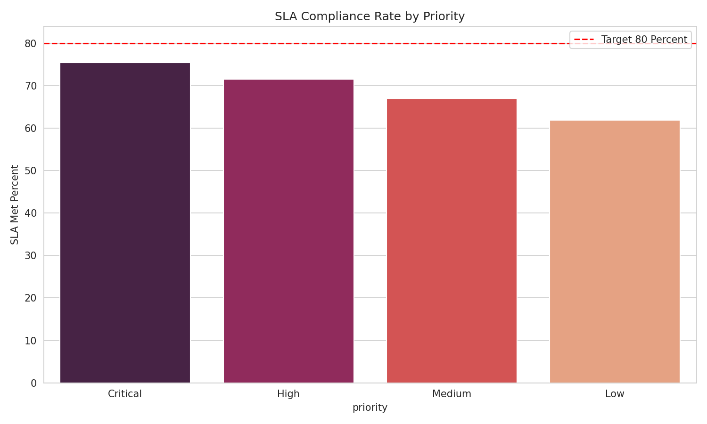
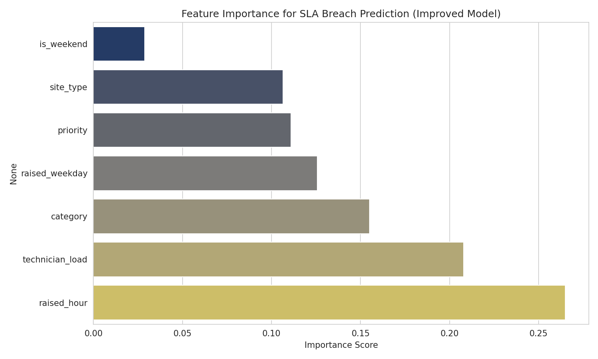
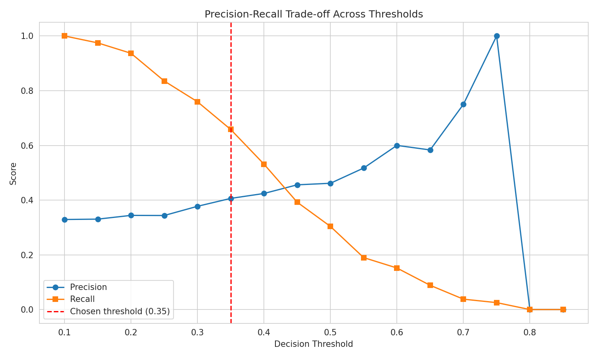

# IT Helpdesk Ticket Analytics

[
A data analysis project examining IT support ticket performance across a multi-site organization — corporate offices, data centers, remote branches, and a maritime/port location — with a machine learning model built to predict SLA breach risk before it happens.

## Project Overview

IT helpdesk teams generate large volumes of support tickets, but few organizations analyze that data to understand *why* some tickets breach service-level agreements (SLAs) while others don't. This project builds a realistic ticket dataset, cleans and explores it, then trains predictive models to flag high-risk tickets — turning raw support data into operational insight.

## Dataset

- 1,200+ synthetic IT helpdesk tickets across 4 site types and 7 issue categories
- Fields: ticket ID, timestamps, site, category, priority, assigned technician, resolution time, SLA target/outcome, status, and customer satisfaction score
- Deliberately includes realistic data quality issues (missing values, duplicates, inconsistent formatting, invalid entries) to demonstrate genuine data cleaning

## Methodology

1. **Data Cleaning** — removed duplicates, standardized category labels, handled missing values (technician, satisfaction score) with context-appropriate strategies, corrected invalid entries
2. **Exploratory Data Analysis** — 7 visualizations covering ticket volume by category, SLA compliance by priority, resolution time by site, technician workload, monthly trends, and a weekday/hour heatmap of ticket volume
3. **Predictive Modeling** — trained Logistic Regression and Random Forest classifiers to predict SLA breach risk, using class balancing to handle the ~30% breach rate
4. **Threshold Tuning** — tested multiple decision thresholds to optimize the precision/recall trade-off based on business priorities (catching more breaches vs. avoiding false alarms)

## Key Findings

- Overall SLA compliance sits at ~67%, with a meaningful gap between average (35 hrs) and median (13 hrs) resolution time, showing a small number of outlier tickets are dragging performance down
- **Time of day and technician workload** are stronger predictors of SLA breach than ticket category or priority — an operational insight, not just a triage one
- At a tuned decision threshold (0.35), the model catches 66% of real breaches, up from 30% at the default threshold, demonstrating the value of tuning models to business needs rather than accepting defaults
- Findings point toward proactive staffing adjustments during high-risk hours as a more effective lever than reactive ticket prioritization alone

## Visualizations

**SLA Compliance by Priority**

**Feature Importance for SLA Breach Prediction**

**Precision-Recall Trade-off Across Thresholds**

## Tech Stack

Python · Pandas · NumPy · Matplotlib · Seaborn · Scikit-learn (Logistic Regression, Random Forest) · Google Colab

## Files in This Repo

- `IT_helpdesk_ticket_analysis.ipynb` — full analysis notebook
- `helpdesk_tickets.csv` — raw dataset
- `helpdesk_tickets_clean.csv` — cleaned dataset
- `charts/` — exported visualizations (category volume, SLA compliance, resolution time, technician load, monthly trend, heatmap, satisfaction, feature importance, confusion matrix, threshold trade-off)

## Author

Gunasheela A S — Computer Science Engineering student, aspiring IT Officer / Data Analyst with a focus on maritime and enterprise IT operations.
